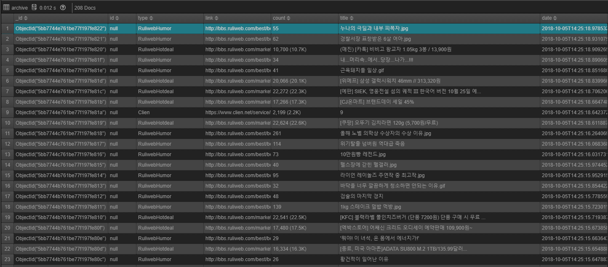

# 커뮤니티 크롤러
대한민국 커뮤니티에 올라오는 많은 게시물 중에서 덧글이 일정량 이상인 글들에 한해서만 크롤링하여 저장하는 머신 입니다.

## 사용 가능한 커뮤니티 목록 
- 클리앙 [모두의공원](http://clien.net/cs2/bbs/board.php?bo_table=park)
- 뽐뿌 [자유게시판](http://www.ppomppu.co.kr/zboard/zboard.php?id=freeboard)
- 웃대 [베스트오브베스트](http://www.todayhumor.co.kr/board/list.php?table=bestofbest)
- slrclub [자유게시판](http://www.slrclub.com/bbs/zboard.php?id=free)
- 루리웹 [유머 베스트 게시판](http://bbs.ruliweb.com/best/selection)
- 루리웹 [핫딜 게시판](http://bbs.ruliweb.com/market/board/1020)
- 루리웹 [취미 게시판](http://bbs.ruliweb.com/hobby)

## 설치 및 개발 환경
- python 3.x, [Mongodb](https://www.mongodb.org), [virtualwrapper](https://virtualenvwrapper.readthedocs.org/en/latest/)
- mkvirtualenv -a \`pwd\` --python python3 cc
- workon cc
- ln -s $(pwd)/pre-commit $(pwd)/.git/hooks/
- pip install -r requirement.txt

## 기동
- python3 serve.py

## License
MIT (http://www.opensource.org/licenses/mit-license.php)

